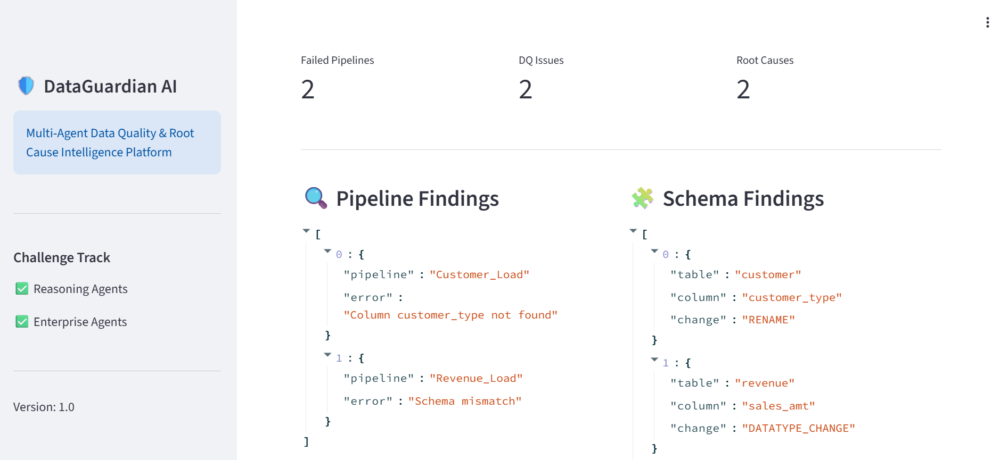
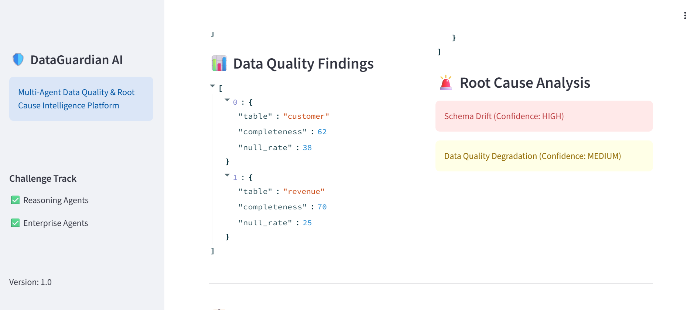
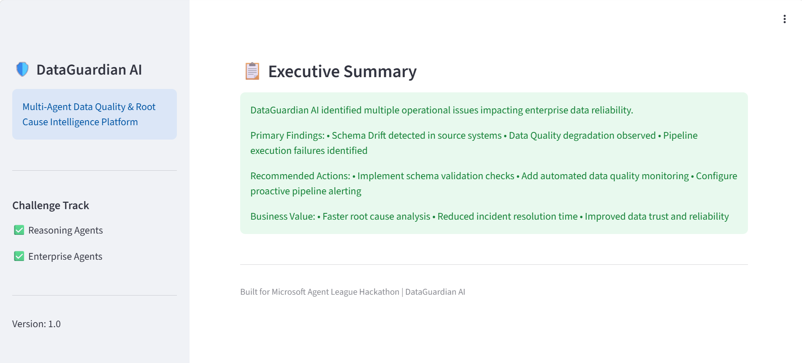

# 🛡️ DataGuardian AI

### Multi-Agent Data Quality & Root Cause Intelligence Platform

🚧 Hackathon Project – Active Development

✅ Multi-Agent Architecture
✅ Root Cause Reasoning Engine
✅ Documentation & Architecture Diagram
✅ Streamlit Dashboard
🚧 Azure OpenAI Integration

---

## Problem Statement

Enterprise data teams spend significant time investigating pipeline failures, schema changes, and data quality issues. Root cause analysis is often manual, slow, and fragmented across multiple systems.

## Why It Matters

Data incidents can disrupt analytics, reporting, and business decisions. Traditional monitoring tools identify symptoms but often fail to explain why failures occur. DataGuardian AI accelerates investigation by combining specialized agents that collaborate to uncover root causes, assess impact, and recommend remediation actions.

---

## Solution

DataGuardian AI is a multi-agent reasoning platform that autonomously analyzes operational signals, identifies root causes, assesses business impact, and recommends corrective actions.

The platform simulates how enterprise AI agents collaborate to investigate incidents and provide actionable intelligence for data engineers, analytics teams, and business stakeholders.

---

## Key Features

* Pipeline Failure Detection
* Data Quality Monitoring
* Schema Drift Detection
* Root Cause Analysis
* Business Impact Assessment
* AI-Powered Recommendations
* Executive Incident Summaries
* Multi-Agent Collaboration
* Enterprise Incident Intelligence

---

## Agent Architecture

### Agent Workflow

Pipeline Agent → Data Quality Agent → Schema Agent → Root Cause Agent → Business Impact Agent → Recommendation Agent → Executive Summary Agent

---

## Demo Flow

1. Pipeline Agent analyzes failed pipeline executions.
2. Data Quality Agent evaluates completeness and null-rate metrics.
3. Schema Agent detects structural changes in source systems.
4. Root Cause Agent correlates findings and identifies likely causes.
5. Business Impact Agent evaluates affected dashboards and records.
6. Recommendation Agent suggests remediation actions.
7. Executive Summary Agent generates a concise incident report.

---

## Technology Stack

* Python
* Pandas
* Streamlit
* GitHub Copilot
* GitHub Codespaces
* Azure OpenAI (Planned)
* Microsoft Foundry IQ Concepts
* LangGraph (Planned)

---

## Microsoft Foundry Integration

DataGuardian AI is designed around Microsoft IQ principles and can be integrated with Azure AI Foundry to power enterprise-grade reasoning workflows.

The platform uses specialized agents to analyze:

* Pipeline execution logs
* Data quality metrics
* Schema metadata
* Business impact indicators

These signals are synthesized by the Root Cause Agent to generate grounded explanations, confidence scores, remediation recommendations, and executive summaries.

This approach aligns with Foundry IQ's vision of enabling AI systems to reason over enterprise operational data rather than relying on isolated signals.

---

## GitHub Copilot Usage

GitHub Copilot was used throughout the development lifecycle to:

* Accelerate agent implementation
* Generate test cases and validation logic
* Refactor Python modules
* Improve documentation quality
* Assist with architecture design and workflow orchestration

Copilot enabled rapid prototyping and iteration while maintaining code quality and development velocity.

---

## Screenshots

### Pipeline Agent

### Data Quality Agent

### Schema Agent

### Root Cause Agent

---

## Sample Investigation Result

### Root Cause Analysis

**Detected Issues**

* Pipeline Failure
* Schema Change Detected
* Data Completeness Drop

**AI Reasoning**

Root Cause: Schema Drift
Confidence: HIGH

Secondary Finding: Data Quality Degradation
Confidence: MEDIUM

**Business Impact**

* Revenue Dashboard affected
* 32,000 records impacted

**Recommendation**

* Implement schema validation before pipeline execution
* Add automated data quality monitoring and alerting

---
### Streamlit Dashboard

## Future Enhancements

* Azure OpenAI Integration
* LangGraph Agent Orchestration
* Microsoft Fabric Integration
* Real-Time Incident Monitoring
* Natural Language Chat Interface
* Predictive Incident Detection
* Agent Memory and Learning

---

## Challenge Track

### Agent League Hackathon

* Reasoning Agents
* Enterprise Agents

---

## Author

Built for the Microsoft Agent League Hackathon using AI-assisted development with GitHub Copilot and Microsoft AI technologies.
