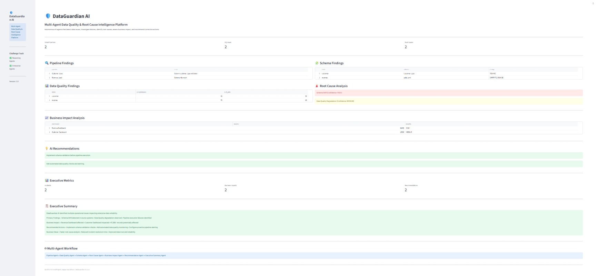

# 🛡️ DataGuardian AI

### Multi-Agent Data Quality & Root Cause Intelligence Platform

🚀 Microsoft Agent League Hackathon Submission

**Primary Track:** Reasoning Agents
**Secondary Track:** Enterprise Agents

---

## Problem Statement

Enterprise data teams spend significant time investigating pipeline failures, schema changes, and data quality issues.

Traditional monitoring tools identify symptoms but often fail to explain:

* Why an incident occurred
* What business assets are affected
* What actions should be taken

As a result, root cause analysis becomes manual, slow, and reactive.

---

## Solution

DataGuardian AI is a Multi-Agent Reasoning Platform that autonomously investigates enterprise data incidents.

Specialized AI agents collaborate to:

* Detect operational failures
* Analyze data quality issues
* Identify schema drift
* Determine root causes
* Assess business impact
* Recommend corrective actions
* Generate executive summaries

The platform demonstrates explainable, multi-step reasoning across enterprise operational data.

---

## Key Features

* Pipeline Failure Detection
* Data Quality Monitoring
* Schema Drift Detection
* Root Cause Analysis
* Business Impact Assessment
* AI-Powered Recommendations
* Executive Incident Summaries
* Multi-Agent Collaboration
* Explainable AI Reasoning
* Enterprise Incident Intelligence

---

## Agent Architecture

---

## Multi-Agent Reasoning Pattern

DataGuardian AI follows a Role-Based Multi-Agent Reasoning Architecture.

Each agent specializes in a specific responsibility and collaborates with downstream agents to progressively refine the investigation.

### Agent Responsibilities

| Agent                 | Responsibility                                   |
| --------------------- | ------------------------------------------------ |
| Pipeline Agent        | Detects failed pipeline executions               |
| Data Quality Agent    | Identifies completeness and null-rate issues     |
| Schema Agent          | Detects schema drift and metadata changes        |
| Root Cause Agent      | Correlates findings and determines likely causes |
| Business Impact Agent | Evaluates affected business assets and records   |
| Recommendation Agent  | Generates remediation actions                    |
| Executive Agent       | Produces executive-level incident summaries      |

This approach enables explainable decision-making rather than isolated anomaly detection.

---

## Agent Orchestration

DataGuardian AI orchestrates multiple specialized agents through a structured reasoning workflow.

Pipeline Agent
↓
Data Quality Agent
↓
Schema Agent
↓
Root Cause Agent
↓
Business Impact Agent
↓
Recommendation Agent
↓
Executive Agent

Each agent contributes evidence that is passed to the next stage, enabling multi-step reasoning and grounded decision making.

---

## Investigation Workflow

### Step 1 – Pipeline Analysis

Pipeline Agent identifies failed pipeline executions and operational anomalies.

### Step 2 – Data Quality Analysis

Data Quality Agent evaluates completeness, null rates, and quality degradation.

### Step 3 – Schema Analysis

Schema Agent detects structural changes, schema drift, and metadata inconsistencies.

### Step 4 – Root Cause Reasoning

Root Cause Agent correlates findings from all agents and identifies likely causes with confidence levels.

### Step 5 – Business Impact Assessment

Business Impact Agent determines impacted dashboards, datasets, and affected records.

### Step 6 – Recommendation Generation

Recommendation Agent generates corrective actions based on identified root causes.

### Step 7 – Executive Summary

Executive Agent produces concise summaries for leadership and operations teams.

---

## Microsoft Fabric IQ Alignment

DataGuardian AI aligns with Microsoft Fabric IQ principles by reasoning over enterprise business concepts rather than isolated technical events.

### Core Business Entities

* Pipeline
* Dataset
* Data Quality Rule
* Schema Change
* Incident
* Business Dashboard
* Recommendation

### Semantic Relationships

Pipeline → Dataset

Dataset → Business Dashboard

Schema Change → Incident

Data Quality Failure → Incident

Incident → Recommendation

Business Impact → Executive Summary

By modeling relationships between operational signals and business outcomes, DataGuardian AI demonstrates semantic reasoning aligned with Microsoft Fabric IQ concepts.

---

## Microsoft IQ Integration

DataGuardian AI leverages Microsoft IQ concepts to enable intelligent reasoning over enterprise operational data.

The platform synthesizes signals from:

* Pipeline execution logs
* Data quality metrics
* Schema metadata
* Business impact indicators

These signals are combined by the Root Cause Agent to produce:

* Grounded explanations
* Confidence scoring
* Impact assessments
* Remediation recommendations

This approach reflects Microsoft's vision for enterprise reasoning systems powered by connected organizational intelligence.

---

## Technology Stack

### Development

* Python
* Pandas
* Streamlit

### AI & Agent Framework

* Multi-Agent Architecture
* Agent Orchestration
* Rule-Based Reasoning Engine

### Development Tools

* GitHub Copilot
* GitHub Codespaces
* GitHub

### Microsoft Technologies

* Microsoft Fabric IQ Concepts
* Azure AI Foundry (Future Integration)
* Microsoft 365 Copilot (Future Integration)

---

## GitHub Copilot Usage

GitHub Copilot was used throughout the development lifecycle to:

* Accelerate agent implementation
* Generate test cases and validation logic
* Improve code quality
* Refactor Python modules
* Generate documentation
* Assist with architecture design and workflow orchestration

Copilot significantly reduced development time while improving productivity and consistency.

---

## Dashboard Preview

---

## Screenshots

### Pipeline Agent

### Data Quality Agent

### Schema Agent

### Root Cause Agent

---

## Sample Investigation Result

### Detected Issues

* Pipeline Failure
* Schema Drift
* Data Quality Degradation

### Root Cause Analysis

Primary Cause: Schema Drift
Confidence: HIGH

Secondary Cause: Data Quality Degradation
Confidence: MEDIUM

### Business Impact

Affected Assets:

* Revenue Dashboard
* Customer Dashboard

Affected Records:

* 47,000+

### Recommendations

* Implement schema validation before pipeline execution
* Add automated data quality monitoring
* Configure proactive pipeline alerting

---

## Business Value

DataGuardian AI helps organizations:

* Reduce incident investigation time
* Improve data reliability
* Increase trust in analytics
* Minimize operational disruptions
* Enable proactive data operations
* Accelerate root cause analysis

---

## Future Enhancements

* Azure OpenAI Integration
* LangGraph Agent Orchestration
* Microsoft Fabric Integration
* Microsoft Teams Incident Notifications
* Real-Time Incident Monitoring
* Predictive Incident Detection
* Agent Memory and Learning

---

## Challenge Alignment

### Reasoning Agents

✅ Multi-Agent Collaboration

✅ Multi-Step Reasoning

✅ Explainable Decision Making

✅ Agent Orchestration

✅ Enterprise Problem Solving

### Enterprise Agents

✅ Enterprise Data Operations Use Case

✅ Business Impact Intelligence

✅ Executive Reporting

✅ Microsoft IQ Alignment

---

## Author

Built for the Microsoft Agent League Hackathon using GitHub Copilot, GitHub Codespaces, and Microsoft AI technologies.

**Project:** DataGuardian AI

**Category:** Multi-Agent Reasoning Platform

**Focus:** Enterprise Data Reliability & Root Cause Intelligence
