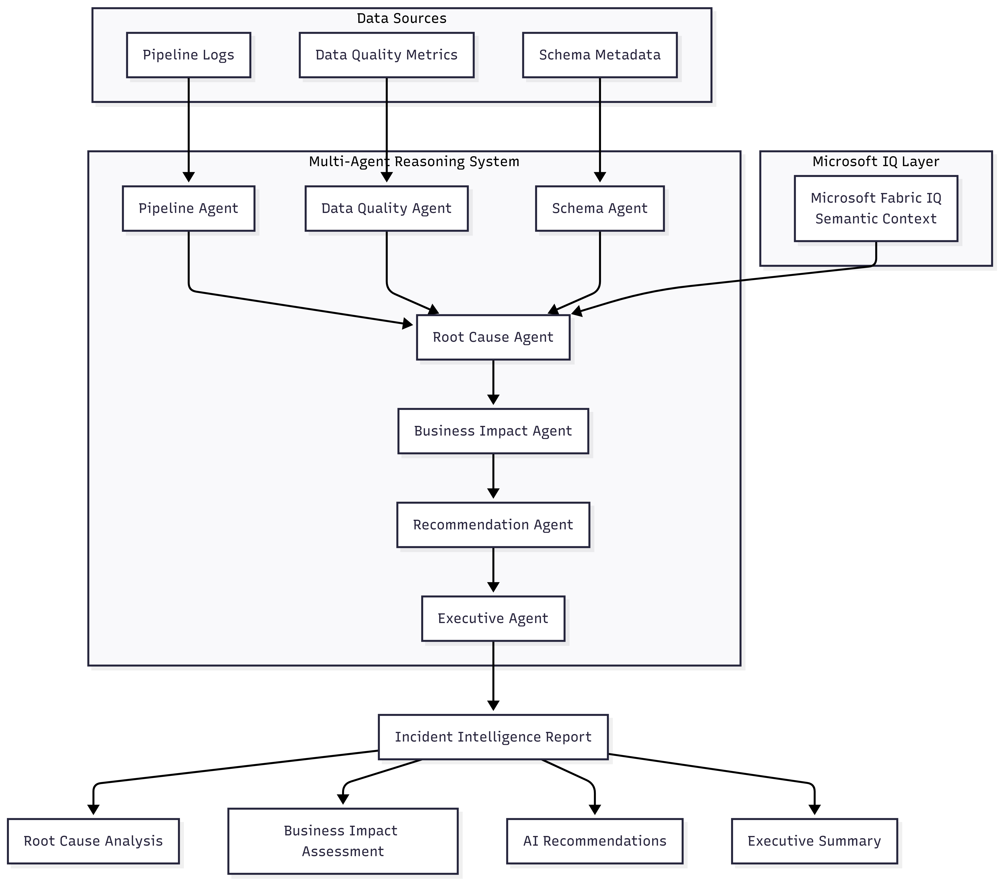
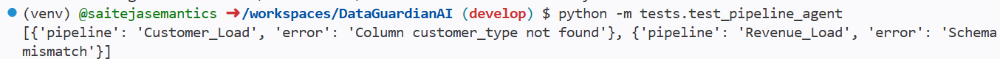
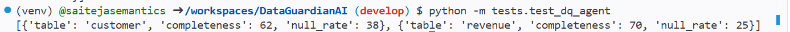
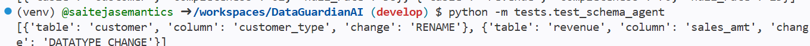
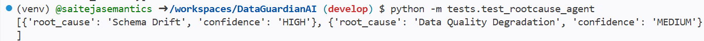

# 🛡️ DataGuardian AI

### Multi-Agent Data Quality & Root Cause Intelligence Platform

## Problem Statement

Enterprise data teams spend significant time investigating pipeline failures, schema changes, and data quality issues. Root cause analysis is often manual, slow, and fragmented across multiple systems.

## Solution

DataGuardian AI is a multi-agent reasoning platform that autonomously analyzes operational signals, identifies root causes, assesses business impact, and recommends corrective actions.

## Key Features

* Pipeline Failure Detection
* Data Quality Monitoring
* Schema Drift Detection
* Root Cause Analysis
* Business Impact Assessment
* AI-Powered Recommendations
* Executive Incident Summaries

## Agent Architecture

## Technology Stack

* Python
* Pandas
* Streamlit
* GitHub Copilot
* GitHub Codespaces
* Azure OpenAI (planned)
* Microsoft Foundry IQ Concepts

## Microsoft Foundry Integration

DataGuardian AI leverages Foundry IQ principles by enabling specialized agents to reason across enterprise operational signals including pipeline logs, data quality metrics, schema metadata, and business impact indicators.

## Screenshots

### Pipeline Agent

### Data Quality Agent

### Schema Agent

### Root Cause Agent

## Current Agent Workflow

Pipeline Agent → Data Quality Agent → Schema Agent → Root Cause Agent → Recommendation Agent → Executive Summary Agent

## Future Enhancements

* Azure OpenAI Integration
* LangGraph Agent Orchestration
* Microsoft Fabric Integration
* Real-Time Incident Monitoring
* Natural Language Chat Interface

## Challenge Track

Agent League Hackathon

* Reasoning Agents
* Enterprise Agents
